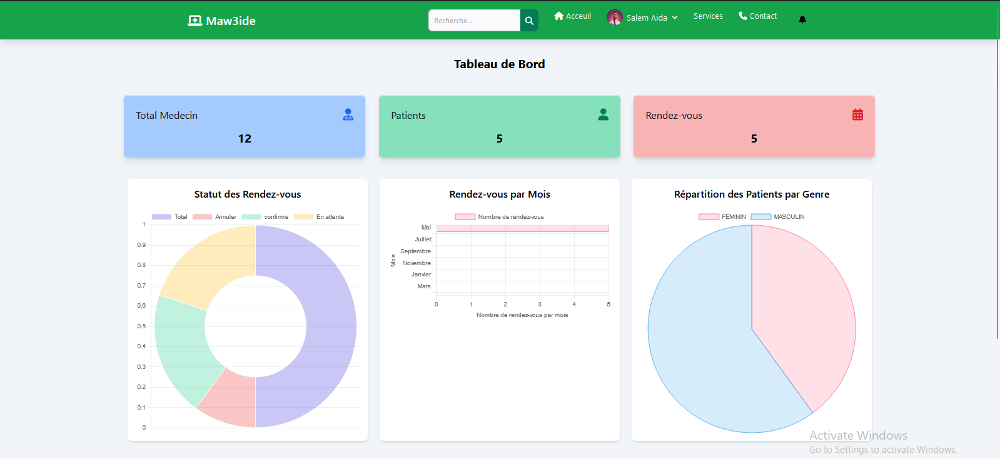

# Maw3ide - Application de Gestion de Rendez-vous Médicaux

Maw3ide est une application Web conçue pour simplifier la gestion des rendez-vous médicaux en ligne. Elle permet aux patients de réserver des consultations avec des médecins de différentes spécialités, tandis que les professionnels de santé peuvent gérer facilement leurs horaires et consultations.

## Fonctionnalités principales

- **Prise de Rendez-vous en Ligne** : Réservez vos consultations médicales en quelques clics.
- **Gestion des Rendez-vous** : Suivez et gérez vos rendez-vous à partir d'une interface intuitive.
- **Statistiques Médicales** : Visualisez les médecins disponibles par spécialité.
- **Connexion Sécurisée** : Accès sécurisé avec authentification pour les utilisateurs (patients et médecins).

## Technologies utilisées

- **Backend** : Django (Python)
- **Frontend** : Tailwind CSS
- **Base de données** : SQLite3

## Captures d'ecran 

### Page d'acceuil


### Page de Connexion


### Liste des Medecin

### Interface Medecin


### Adminstrateur du systeme




1. Clonez ce dépôt :
  
   ```bash
    Via SSH
    git clone git@github.com:Fall-Brahim/Gestion-de-Rendez-Vous-Medicaux.git
   si non 
     git clone https://github.com/Fall-BR](https://github.com/Fall-Brahim/Gestion-de-Rendez-Vous-Medicaux.git

3. Acceder au repertoire du projet
   ```bash
   cd Gestion-de-Rendez-Vous-Medicaux
4.  Installez les librairies
    ```bash
       pip install -r requirements.txt
5.  Appliquer les migrations
    ```bash
       python manage.py migrate
6.  Lancer le Serveur
    ```bash
       python manage.py runserver
7.  Acceder a l'application a l'adresse `127.0.0.1:8000/Users/`


